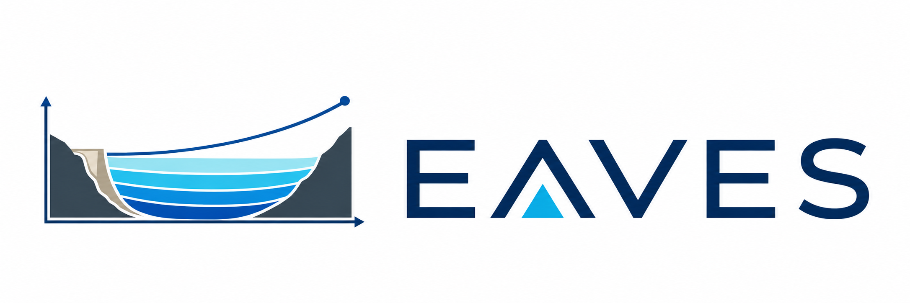
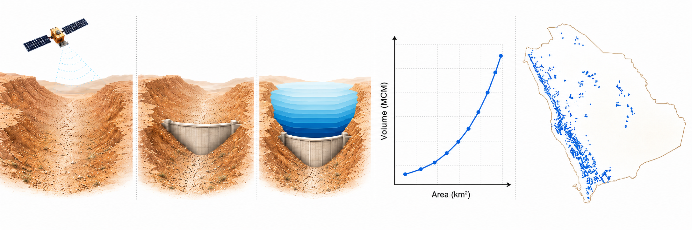

# 🏔️💧 **EAVES: Elevation-Area-Volume Estimation from SRTM**

*Reconstructing reservoir bathymetry for ungaged arid-basin dams from SRTM topography acquired before most of them were built.*

---

[](environment.yml)
[](https://doi.org/10.5281/zenodo.20731020)
[](https://github.com/hyex-research)

---

<p align="center">
  
</p>

## 🗺️ Overview

Reservoir bathymetry is the missing link between remotely sensed water extent and storage. In arid and hyper-arid **ungaged basins**, bathymetric surveys are almost never available, so the Elevation-Area-Volume (EAV) relationship that ties surface area to volume has to be inferred. **EAVES** reconstructs it from the **Shuttle Radar Topography Mission (SRTM)** digital elevation model, exploiting the fact that SRTM was acquired in February 2000, before most dams in arid regions were constructed, so the valley topography is preserved in the DEM.

For each dam the pipeline:

1. **Locates** the dam site on the SRTM DEM and searches for an optimal wall placement across the valley
2. **Flood-fills** the valley up to the spillway height to reconstruct the reservoir footprint
3. **Integrates** the depth-area relationship into a continuous EAV curve
4. **Fits** a power-law model $V = c \cdot A^b$ to parameterize the area-volume relationship
5. **Regionalizes** the fitted parameters so that dams with unreliable SRTM fills still receive physically plausible curves

The headline product, `eaves_params.csv`, provides the area-volume relationship for every dam in the study domain, enabling satellite-observed water extent to be converted into storage estimates for downstream hydrological modeling.

> **Provenance:** EAVES was developed and validated for the arid and hyper-arid dams of **Saudi Arabia** (526 dams: 322 SRTM-derived, 204 regionalized). The codebase is portable and can be applied to any region for which the required inputs (SRTM tiles, MERIT Hydro, a dam catalog) are available.

<p align="center">
  
</p>

## 📂 The data

The Saudi Arabia EAV curves are ready to use directly, no run required:

- **[`eaves_params.csv`](region/ksa/output/1_results_csv/eaves_params.csv)** - power-law coefficients ($c$, $b$) for all 526 dams. The one file most users need.
- **[`eaves_summary.csv`](region/ksa/output/1_results_csv/eaves_summary.csv)** - full per-dam table: quality grade, uncertainty flags, fitted statistics, and topographic features.
- **[`DATA_DICTIONARY.md`](region/ksa/output/1_results_csv/DATA_DICTIONARY.md)** - every column defined, with units.

Convert a satellite-observed water area $A$ to storage with the dam's own coefficients: $V = c \cdot A^{b}$. The full release (per-dam hypsometries and the validation suite) is archived on Zenodo (<https://doi.org/10.5281/zenodo.20728129>).

## 🚀 Quickstart

```bash
conda env create -f environment.yml
conda activate eaves
./run_all.sh region/<country>/<country>.json
```

This runs the full chain: placement-and-fit pipeline, validation, uncertainty propagation, panel figures, and the Markdown report. See [documentation/usage.md](documentation/usage.md) for flags, opt-in diagnostics, testing, and the settings-file reference.

## 📚 Documentation

| Document | Contents |
| -------- | -------- |
| [documentation/method.md](documentation/method.md) | The algorithm: wall placement, EAV construction, trusted/training sets, regionalization, limitations |
| [documentation/structure.md](documentation/structure.md) | Repository layout and module map |
| [documentation/outputs.md](documentation/outputs.md) | Every file a run produces: CSVs, panels, QC maps, report |
| [documentation/data-dependencies.md](documentation/data-dependencies.md) | Required and optional input datasets, sources, licensing notes |
| [documentation/usage.md](documentation/usage.md) | Run commands, flags, validation diagnostics, testing, settings keys |
| `region/<country>/output/1_results_csv/DATA_DICTIONARY.md` | Column-level definitions and controlled vocabularies for the released data |
| [CHANGELOG.md](CHANGELOG.md) | Versioned change log |

## 📄 Related manuscript

This repository accompanies the manuscript:

> **"Elevation-area-volume curves for 526 Saudi Arabian reservoirs from SRTM topography and regionalization"**
>
> Ivanović, N., Dash, S.S., Hunt, J.D., Alharbi, R., & Beck, H.E.

If you use this repository in academic work, please cite the manuscript and this software. Citation metadata, including DOIs, is in [`CITATION.cff`](CITATION.cff).

## 📜 License

The source code is licensed under the [Apache License 2.0](https://www.apache.org/licenses/LICENSE-2.0) (`LICENSE`). The data products (the EAVES dataset and the files under `region/<country>/output/`, archived on Zenodo) are licensed under [Creative Commons Attribution 4.0 International (CC BY 4.0)](https://creativecommons.org/licenses/by/4.0/) (`LICENSE-DATA`).

[](https://www.apache.org/licenses/LICENSE-2.0)
[](https://creativecommons.org/licenses/by/4.0/)
