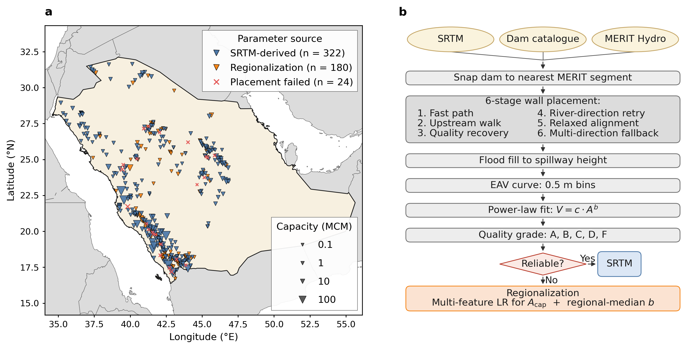
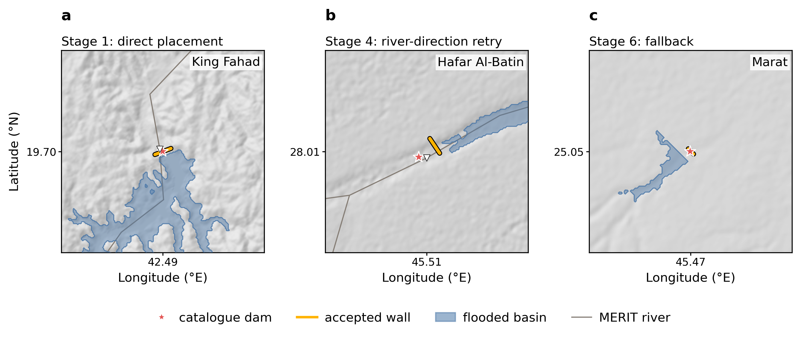
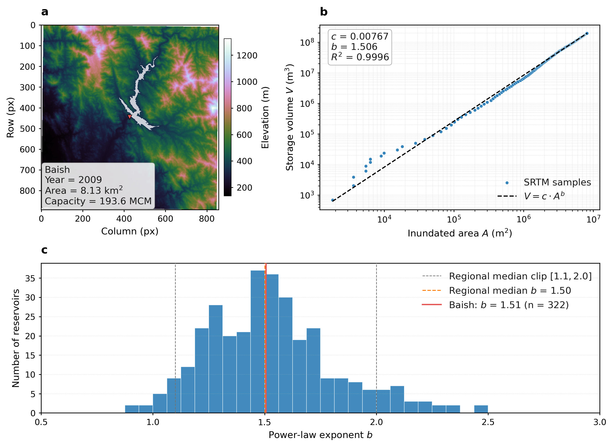
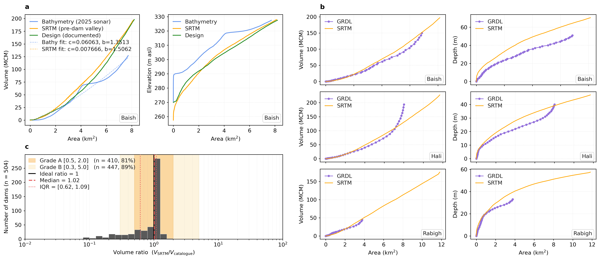
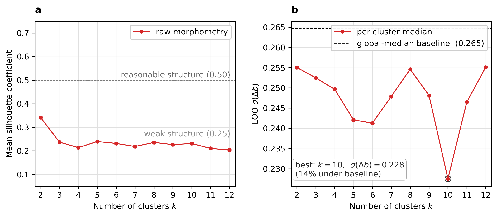
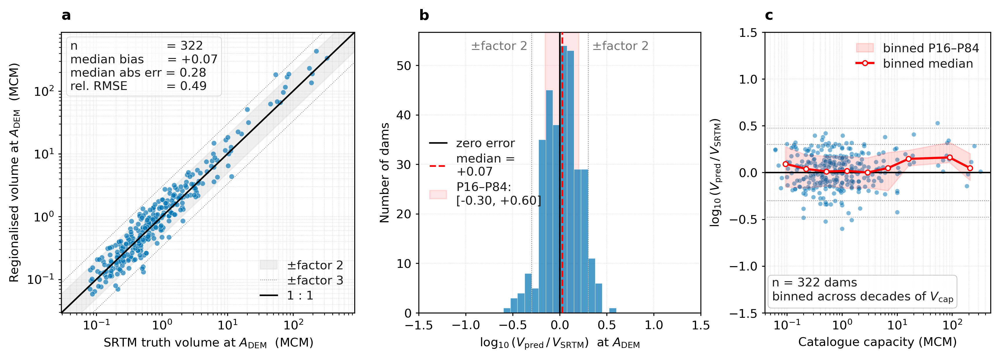
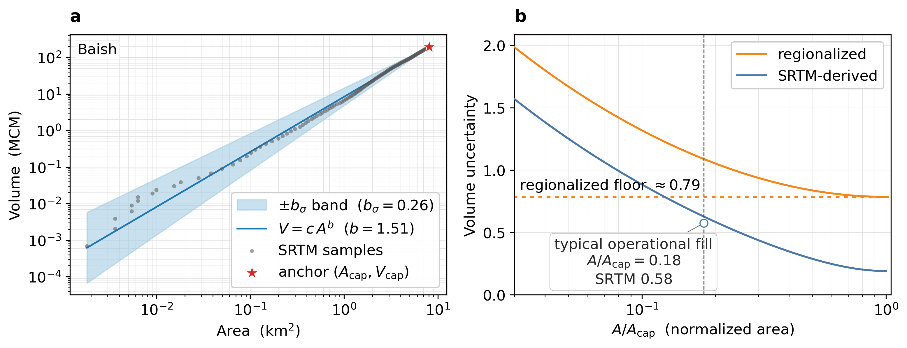

# EAVES domain report — Saudi Arabia

_Generated: 2026-06-10 14:30 UTC_

_Source code: `eaves/` package; this report: `eaves.postprocess.report`._

This document characterizes the reservoir population in the configured region and explains the EAVES pipeline that produced its elevation–area–volume (EAV) curves. It covers the physics of the power-law parameterization, the DEM-based fitting procedure used for trusted dams, the regionalization recipe used for the remainder, and the leave-one-out validation behind the accuracy figures reported in the panel set. Every number quoted below is regenerated from the pipeline outputs at runtime, so figures and prose move together as the catalogue or methodology evolves.

## Executive summary

- **Catalogue**: 526 dams with assigned EAV parameters.
- **DEM-derived curves**: 322 dams have curves fit directly from SRTM-clipped flood-fills (these are the trusted population).
- **Regionalized curves**: 204 dams have curves assigned via a region-trained empirical recipe because the DEM fit failed quality gates — of which 24 are pipeline failures (placement, fill, or fit) regionalized with topographic features captured at failure time.
- **Operational fill behavior**: the median ratio $A_\mathrm{sat}^{P95} / A_\mathrm{DEM}$ is **0.18**, meaning a typical reservoir's observed maximum extent reaches only ~17.9% of its DEM-derived design footprint. This is the central physical fact behind the regionalization method choice below.
- **Sediment budget**: assuming delivered sediment yields (the RUSLE-by-SDR product of Dash et al. 2025, so no additional delivery ratio is applied) and a deposited bulk density of 1.30 t m$^{-3}$, the median predicted capacity loss by 2026 is **47.5%** of the catalogue value (loss capped at 100% by trap saturation; 149 reservoirs reach full siltation).
- **Regionalization accuracy (LOO on trusted dams, multi-feature LR anchor)**: 89% of predictions within a factor of 2 of the SRTM-derived truth, median bias +7%.

## Pipeline overview

EAVES consumes a national reservoir catalogue (latitude, longitude, dam height, spillway height, storage capacity, construction year), void-corrected SRTM elevation tiles, MERIT-Hydro river and basin polygons, an optional pre-computed satellite water-extent time series per dam, and optional sedimentation-yield estimates per dam. For each dam it executes the following stages, all coded in the `eaves` package:

1. **Preprocessing** (`eaves.preprocess`): MERIT-Hydro segments are clipped to a per-dam bounding box, segments longer than $2\,\mathrm{km}$ are split, and each dam is snapped to the nearest river segment within $1\,\mathrm{km}$.
2. **DEM clip and reprojection** (`eaves.pipeline.terrain`): the SRTM tile mosaic is clipped to a per-dam radius and reprojected to the appropriate UTM zone.
3. **Dam wall placement and flood-fill** (`eaves.pipeline.placement`, `eaves.pipeline.curves`): a six-stage cascade tries an aligned crest at the catalogue location (Stage 1), walks upstream along the valley axis (Stage 2), recovers from poor geometry or under-volume fills (Stage 3), retries upstream along the river vector (Stage 4), relaxes the flow-alignment filter (Stage 5), and finally falls back to a multi-direction fill (Stage 6). Acceptance gates reject fills that leak downstream, are centroid-displaced, or fail volume sanity checks.
4. **Power-law fit** (`eaves.pipeline.curves`): the resulting $(A, V)$ pairs over the elevation range $[z_\mathrm{min}, z_\mathrm{spillway}]$ are fit to $V = c A^b$ by nonlinear least squares, returning $(c, b, r^2)$.
5. **Quality grading and reliability tagging** (`eaves.postprocess.regionalization`): each fit gets a grade A–F. The trusted subset is the union of A and B grades that also satisfy quality $\in$ {A, B}, $r^2 \ge 0.98$, $0.3 \le V_\mathrm{SRTM}/V_\mathrm{cap} \le 5.0$, $n_\mathrm{pixels} \ge 50$, $b$ defined. The capacity floor used to define the training set is chosen by a sweep of `frac_reliable` against candidate cutoffs (see Fig. S2).
6. **Regionalization** (`eaves.postprocess.regionalization`): dams outside the trusted subset receive $(c, b)$ from a region-trained empirical recipe described below.
7. **Validation** (`eaves.postprocess.validation`): leave-one-out on the trusted dams gives per-recipe accuracy distributions.

Outputs land under `<OUTPUT_DIR>/1_results_csv/` and `<OUTPUT_DIR>/2_results_plots/`.

_Figure 1. (a) Spatial distribution of catalogued dams within the target country, sized by storage capacity and colored by parameter source. (b) Flowchart of the EAVES pipeline from catalogue and SRTM inputs through to the per-dam EAV table._

## Physics of the area–volume relation

Reservoir storage is integrated from a hypsometric area–elevation function: $V(z) = \int_{z_\mathrm{min}}^{z} A(\zeta)\,\mathrm{d}\zeta$. For a valley filled by a transverse dam, the wetted area at elevation $z$ is set by where the water surface intersects the surrounding terrain, which is well approximated by a power-law in depth: $A(z) \propto (z - z_\mathrm{min})^{\beta}$ with $\beta > 0$. Integrating that area against depth and expressing the result against area rather than depth yields the compact form

$$V = c\,A^{b}, \quad b = \tfrac{\beta + 1}{\beta}.$$

Two geometric extremes bracket the exponent:

- A **cylindrical** reservoir (vertical walls, constant area) has $\beta \to \infty$ and $b \to 1$.
- A **wedge-shaped** two-dimensional valley fill (the classical valley-fill end-member) has $\beta = 1$ and $b = 2$.

Real reservoirs land between these. The bulk of trusted KSA dams cluster around $b \sim 1.5$, which corresponds to $\beta = 2$ — a three-dimensional converging valley.

In this region's trusted set ($n = 322$), $b$ has median **1.50** with $1\sigma = 0.26$, P05–P95 range [1.11, 2.10], and absolute range [0.88, 2.50]. The width of that distribution is the dominant geometric uncertainty in regionalized curves.

The coefficient $c$ sets the absolute scale of the curve. Once $b$ is fixed, anchoring at a known point $(A_\mathrm{cap}, V_\mathrm{cap})$ pins $c = V_\mathrm{cap} / A_\mathrm{cap}^{b}$. This back-solve is exact at the anchor, so any uncertainty in $b$ shows up as $V_\mathrm{pred} / V_\mathrm{true} = (A/A_\mathrm{cap})^{\Delta b}$ at other water levels. A $1\sigma$ mismatch in $b$ therefore produces ~20% volume error at $0.5 A_\mathrm{cap}$ and ~84% at $0.1 A_\mathrm{cap}$. Users who need accuracy at very low water levels should treat the curve as a structural estimate, not a precise prediction.

## Domain characterization

### Catalogue demographics

The placement pipeline produces a fit summary for $n = 504$ dams. Together with 24 additional records that fail pipeline gating but carry enough catalogue metadata to be regionalized, **526 dams** in total receive an EAV curve assignment (322 SRTM-derived, 204 regionalized). Aggregate design storage is **2,437 MCM**. The capacity distribution is strongly right-skewed: median 0.45 MCM, P05–P95 = [0.07, 10.0] MCM, maximum 325.0 MCM. By size class:

| Class | Count |
| --- | --- |
| $V_\mathrm{cap} \ge 100$ MCM | 5 |
| $V_\mathrm{cap} \ge 25$ MCM | 14 |
| $V_\mathrm{cap} \ge 5$ MCM | 42 |
| $V_\mathrm{cap} < 1$ MCM | 371 |

Construction years span 1955–2020 with the median dam built in 2008. Era breakdown:

| Era | Count |
| --- | --- |
| Pre-1980 | 39 |
| 1980–2000 | 139 |
| 2000–2010 | 137 |
| Post-2010 | 168 |
| Year unknown | 21 |

The 21 year-unknown dams carry no catalogue construction date. They are retained in the population and in every EAV product; only the age-dependent statistics (era assignment above, sediment budget below) exclude them, since fabricating a year would bias those figures.

### Operational fill behavior

For the 282 trusted dams with a satellite water-extent time series, the 95th-percentile observed water area is compared against the DEM-derived spillway-level footprint. The ratio $A_\mathrm{sat}^{P95} / A_\mathrm{DEM}$ characterizes how fully a reservoir is operated relative to its design.

In this region, the median ratio is **0.18**, meaning a typical reservoir's largest observed extent reaches only ~17.9% of its design footprint. The P16–P84 band is [0.03, 0.48]. Only 45 out of 282 reservoirs (16.0%) ever reach $\ge 0.5\,A_\mathrm{DEM}$ in the observation window.

Physically this signal reflects a combination of (a) arid-zone hydrology with sparse, episodic inflows that rarely accumulate to design pool, (b) operational drawdown for irrigation and domestic supply, (c) seepage and evaporation losses, and (d) the design margin built into nominal capacities. The signal is _not_ caused by sedimentation (sediment fills the bottom of the reservoir without much reducing the spillway-level area) and _not_ caused by DEM oversizing (at the only available bathymetric ground-truth site — Baish — the SRTM footprint matches the design-table spillway area to within ~1%).

This is the central physical fact that motivates the regionalization recipe in this report: an anchor based on the satellite-observed maximum extent does not match the design footprint the catalogue capacity refers to, so anchoring $V_\mathrm{cap}$ against $A_\mathrm{sat}^{P95}$ inflates $c$ by $(A_\mathrm{DEM}/A_\mathrm{sat})^{b}$, of order $\sim 13.2\times$ in this region. Anchoring against a DEM-derived $A_\mathrm{cap}$ instead keeps both endpoints in the design regime.

### Sediment budget

A first-order sediment budget is computed from catchment-specific delivered-yield estimates (`sed_yield_t_ha_yr`) and upstream catchment areas, propagated to the reference year (2026) with deposited bulk density $\rho_\mathrm{sed} = 1.30\,\mathrm{t\,m^{-3}}$. The yield input is *delivered* sediment yield at the reservoir inlet -- Dash et al. (2025) compute it as RUSLE gross erosion times the Boyce (1974) area-dependent delivery ratio (their Eqs. 2-4) -- so no additional delivery ratio is applied here (a second SDR would double-discount delivery). The accumulated trap volume is $V_\mathrm{sed} = Y \cdot A_\mathrm{cat} \cdot (t - t_\mathrm{built}) / \rho_\mathrm{sed}$, and the predicted fractional capacity loss is capped at $100\%$ by trap saturation (a reservoir cannot lose more storage than it holds).

Across $n = 483$ dams with all required inputs, the predicted median capacity loss is **47.5%** of design capacity, with P16–P84 = [12.2%, 100.0%]. 233 reservoirs are predicted to have lost $\ge 50\%$ of their capacity, and 149 reach full siltation ($\ge 100\%$ of design before capping, i.e. the integrated sediment trap volume meets or exceeds the original storage, typically very small headwater impoundments). The per-dam capped fraction and a categorical risk band are released as `predicted_silt_fraction` and `sediment_risk` in `eaves_summary.csv`.

The single bathymetric ground-truth comparison available (Baish, id_120000) shows this first-order budget under-predicts the observed loss by a factor of ~1.6 at that site (predicted ~23% versus ~36% from the 2025 sonar over the same window), consistent with site-specific sediment yield somewhat above the regional first-order input. The national capacity loss implied by the budget matches the ~32% reported by Dash et al. (2025) from the same yield estimates. The per-dam numbers should nevertheless be read as first-order screening indicators, not site predictions. A region-specific calibration would benefit from comparative bathymetry on a small panel of reservoirs spanning the size range.

Crucially, sediment fills the bottom of the reservoir but does not change the spillway-level area, so the EAV curves shipped in this report are _design_ curves rather than current operational curves. A sediment-corrected operational curve set can be produced by subtracting $V_\mathrm{sed}$ from the design $V$ axis (with the curve truncated below the predicted sediment floor) but is not the canonical product.

### Geometry distribution and regionalization features

On the trusted subset ($n = 322$), the power-law exponent $b$ has median **1.50** ($1\sigma$ width 0.26). This sits in the classical valley-fill regime and is consistent with the wadi geometry that dominates the catalogue.

The empirical area–capacity relation, fit on the trusted dams as $\log A_\mathrm{cap}\,[\mathrm{km}^2] = \alpha + \beta \log V_\mathrm{cap}\,[\mathrm{MCM}]$, yields $\alpha = -1.27$, $\beta = 0.72$ with a residual RMS of a factor of 3.38 over $n = 322$ trusted dams. The exponent $\beta$ is close to the geometric expectation $2/3$ for cone-like valley fills, which is the structural basis for using this relation as the regionalization anchor.

## SRTM-derived curves

For each dam that survives placement and quality gating, the curve is fit directly from the SRTM-clipped flood-fill: at each elevation bin in $[z_\mathrm{min}, z_\mathrm{spillway}]$ the wetted area $A(z)$ is computed by counting pixels below $z$ in the footprint, the corresponding volume $V(z) = \int A\,\mathrm{d}z$ is obtained by trapezoidal integration, and the resulting $(A, V)$ pairs are fit to $V = c A^{b}$. The procedure is purely geometric: it uses no satellite or in-situ data. Curves that pass the trusted-set filter (quality $\in$ {A, B}, $r^2 \ge 0.98$, $0.3 \le V_\mathrm{SRTM}/V_\mathrm{cap} \le 5.0$, $n_\mathrm{pixels} \ge 50$, $b$ defined.) are the reference against which all other claims in this report are calibrated.

Two cross-references against independently-produced datasets provide circumstantial consistency checks (not validation in the strict sense, because both anchors use methodologies distinct from EAVES): (i) the Baish bathymetric sonar survey -- which measures the _current operational_ reservoir floor rather than the pre-impoundment valley EAVES integrates -- lies well below the SRTM curve at intermediate water levels (sonar volume ~30-65% under SRTM, the expected signature of ~16 yr of accumulated sediment), while the design table tracks SRTM within ~11% in volume and ~1% in spillway-level area; (ii) three GRDL Landsat-derived $A$--$z$ curves -- reconstructed from Landsat-observed extents with a deep-learning bathymetry model rather than from SRTM topography directly -- agree visually with the SRTM curves over the observed depth range. These anchor the EAVES output in the neighborhood of independently-measured datasets but do not constitute volumetric validation.

_Figure 2. Worked examples of the six-stage wall-placement cascade. (a) Stage 1 fast-path placement on a representative wadi reservoir. (b) Stage 4 river-direction retry. (c) Stage 6 fallback fill on a difficult target. Red star: catalogue dam location. Amber line: accepted wall segment. Blue polygon: flooded basin at spillway level._

_Figure 3. Per-dam outputs on the bathymetry-validated reservoir. (a) SRTM DEM with the inundated footprint overlaid. (b) Area–volume curve on log–log axes with the fitted power law. (c) Histogram of the exponent $b$ across the trusted-set reservoirs._

_Figure 4. Cross-reference comparison against independently-produced reservoir datasets — not validation in the strict sense: sonar measures the current operational bathymetry (post-sediment) and GRDL reconstructs bathymetry from Landsat-observed extents with a deep-learning model, so both methodologies differ from EAVES. (a) Sonar bathymetry vs SRTM for the Baish reservoir: $V(A)$ on the left, elevation–area on the right. (b) GRDL Landsat-derived curves vs SRTM for three reference reservoirs. (c) Distribution of $V_\mathrm{SRTM}/V_\mathrm{catalogue}$ across the full catalogue, with the Grade A/B bands marked._

## Regionalization

Dams whose DEM fit fails the trusted-set filter are assigned $(c, b)$ by a region-trained empirical recipe rather than per-dam DEM fitting. The recipe has two pieces. Both pieces are *trained on the region's own trusted dams*, so the method itself is portable but its coefficients are region-specific.

_Choice of $b$._ The shipped recipe assigns every regionalized dam the regional median **$b = 1.50$**. This is the principled choice given a strong empirical result: $b$ is **not predictable from morphometric features alone** with the data we have. We tested three increasingly flexible alternatives before settling on the median, and each one fell short.

_1. Multivariate regression (linear and random forest)._ Trained `valley_ratio`, `channel_slope`, `mean_catchment_slope`, and `dam_height_m` against $b$ on the trusted set in a leave-one-out cross-validation. Both LinearRegression and RandomForestRegressor were tried. The selection gate requires $R^2_\mathrm{LOO} \ge 0.25$ for a regression to replace the median. Both candidates fell below: each individual feature explains less than 10 % of the variance in $b$ (Spearman $|\rho| \le 0.31$, so $R^2 \le 0.10$ per feature), and the features are partly redundant, so combining them adds little. The regression branch is rejected; the median is used.

_2. Morphological clustering with a per-cluster median._ Even when features can't drive a smooth regression, they may carve the trusted set into morphologically homogeneous clusters whose internal $b$ spread is tighter than the population spread. We tested this directly: k-means in log-space, $z$-scored, on the raw-morphometry feature set (released in `validation/b_clustering_diagnostic.csv`), sweeping $k = 2 \ldots 12$. Best LOO $\sigma(\Delta b)$: **0.23 at $k = 10$**, versus **0.26** for the global median — a genuine but modest **~14 % tightening** (Fig. S1, panel b). The supporting silhouette analysis (Fig. S1, panel a) shows mean silhouette coefficients in the **0.20–0.34** range across every feature set and every $k$, i.e. below the 0.50 conventional threshold for _reasonable_ cluster structure — there is no natural morphological partition to exploit. Two things drive the small remaining gain: (a) every morphological feature individually has Spearman $|\rho| \le 0.31$ with $b$, so cluster boundaries blur; (b) the within-cluster variance of $b$ is comparable to the between-cluster differences, meaning the clusters don't actually separate the population into distinct $b$ regimes.

_Figure S1. K-means clustering diagnostic on the trusted SRTM dams in log-transformed morphometric feature space. (a) Mean silhouette coefficient versus number of clusters $k$ for the raw-morphometry feature set. It remains below the conventional 0.50 _reasonable structure_ threshold for every $k \ge 3$; the $k = 2$ peak at 0.34 reflects a single elongated population, not two morphological types. (b) Leave-one-out $\sigma(\Delta b)$ for a per-cluster-median predictor of $b$ versus the global-median baseline (dashed). The best configuration improves on the baseline by ~14 %, well within the intrinsic noise floor of fitting the power law to integrated SRTM curves. The diagnostic justifies the global-median choice for $b$ in the production recipe._

_3. The intrinsic noise floor._ Across every regression and clustering configuration we tried, the leave-one-out residual on $b$ converges to $\sigma(\Delta b) \approx 0.24$. This is the noise floor of fitting a two-parameter power law to integrated SRTM curves: the value of $b$ is sensitive to (i) the discrete pixel-bin assignment of the flood fill, (ii) void interpolation in the DEM, (iii) the catalogue-driven spillway-height overrides that rewrite obviously-mistyped catalogue rows (`curves.py:65-73`), and (iv) where the capacity cap truncates the curve. Two dams with identical valley-ratio / slope / length / height signatures can fit different $b$ purely from these integration-side artefacts. No feature-based predictor can resolve $b$ below that floor.

_Practical implication._ Adopting cluster-medians instead of the global median would buy $\sim 14 \%$ tighter $\sigma_b$ at the cost of an additional moving part (cluster fit + per-dam assignment) that doesn't change the qualitative story. We retain the **global median** as the shipped recipe: it is the simplest assignment consistent with the data, and the `b_sigma` column quantifies the residual uncertainty without overclaiming structure we cannot resolve.

_Regression branch retained as a region-portable fallback._ If a future region's catchment-feature distribution produces $R^2_\mathrm{LOO} \ge 0.25$, the regression auto-activates ([`regionalization.py:259-298`]) and predicted $b$ values are written under the `regr_derived` source label (reserved for that branch; absent from the released KSA files). This has never fired on the KSA catalogue.

_Choice of $c$._ The shipped recipe anchors each regionalized dam at the predicted full-pool area $A_\mathrm{cap}$ and back-solves $c = V_\mathrm{cap} / A_\mathrm{cap}^{b}$. The prediction is a closed-form linear regression of $\log A_\mathrm{cap}$ on seven log-space features trained on the trusted DEM footprints:

$$\log A_\mathrm{cap} = \alpha_0 + \sum_{i=1}^{7} \alpha_i \log X_i$$

with $X_i \in \{$ `capacity_mcm`, `dam_height_m`, `spillway_height_m`, `valley_ratio`, `channel_slope`, `mean_catchment_slope`, `upstream_area_km2` $\}$. Any feature that is missing for a given dam is imputed with the training-set median before prediction, so the regression always returns a finite value and there is a single recipe for every regionalized row in `eaves_params.csv`.

Two earlier drafts of the pipeline are still evaluated by the validation module for the comparison below: (i) anchoring at the satellite 95th-percentile water area, and (ii) a single-feature $\log A_\mathrm{cap} = \alpha + \beta \log V_\mathrm{cap}$ regression. Both were retired in favor of the multi-feature anchor.

Because reservoirs in this region operate at only ~17.9% of design footprint, the satellite anchor captures an _operational_ area rather than the design area that the catalogue $V_\mathrm{cap}$ refers to. Mixing a design volume with an operational area inflates $c$ by $\sim (1/0.18)^{b} \approx 13.2\times$ on median. Both DEM-trained anchors stay in the design regime by construction.

## Validation

This is the formal validation of EAVES: a self-consistent test _within_ the EAVES methodology, in contrast to the cross-references above which use independently-produced datasets. Per-recipe accuracy is measured by masking each trusted dam in turn, retraining the regionalization recipe on the remaining trusted dams, predicting the masked dam's $V$ at $A = A_\mathrm{DEM}$, and comparing against the SRTM-derived truth. Errors are computed in $\log_{10}$ ratio space and reported below in the relative convention (a percentage, or a multiplicative factor for larger values). The full per-dam table lives in `<CSV_DIR>/validation/regionalization_loo.csv` and the visual summary in panel set p5.

| Metric | Satellite anchor (retired) | Log–log anchor | Multi-feature LR (shipped) |
| --- | --- | --- | --- |
| n | 322 | 322 | 322 |
| median bias | 9.6× | +11% | **+7%** |
| Median abs. % error | — | — | **28%** |
| Relative RMSE | — | — | **49%** |
| Within $2\times$ | 17% | 66% | **89%** |
| Within $3\times$ | 25% | 89% | **98%** |
| Within $10\times$ | 51% | 100% | **100%** |

'Within $n\times$' means $|\log_{10}(V_\mathrm{pred} / V_\mathrm{SRTM})| \le \log_{10}(n)$, i.e. the predicted volume sits between $V_\mathrm{SRTM} / n$ and $V_\mathrm{SRTM} \cdot n$.

The shipped multi-feature recipe halves the $1\sigma$ spread of the single-feature log–log alternative (and is roughly five times tighter than the retired satellite anchor). The bias is essentially zero across all three candidates, but only the DEM-trained anchors stay in the design regime that the catalogue $V_\mathrm{cap}$ refers to.

_Figure 5. Leave-one-out validation of the regionalization recipe on the trusted SRTM-derived dams. (a) Predicted vs SRTM-truth volume at the DEM full-pool area, with 1:1 line and ±factor-2 / ±factor-3 bands; the inset box lists the headline accuracy statistics. (b) Signed prediction error distribution, zero line, median, and P16–P84 band marked. (c) Error stability across catalogue capacity; the binned median tracks zero across four decades of $V_\mathrm{cap}$._

Two caveats. First, the LOO test measures the recipe's ability to reproduce _the SRTM-derived curve_, not the absolute truth. The SRTM curves themselves have an unquantified residual error ($\lesssim 20\%$ on the one available bathymetric anchor). Second, the LOO test is run on trusted-like dams; the actual regionalized population is systematically smaller and steeper, so the realised accuracy on those dams may have a wider spread than panel p5 reports. The structural bias correction ($\sim 10\times$ on the satellite-anchor recipe) carries through regardless.

## Uncertainty on volume predictions

The population spread of the exponent $b$ ($b_\sigma \approx 0.26$, the dimensionless P16--P84 half-width, identical for every dam) is the single number that propagates into the V confidence band. It is released per dam as the `b_sigma` column of `validation/v_uncertainty.csv` (the near-identical `b_cluster_baseline_sigma` in `domain_characterization.csv` is the separate clustering-baseline diagnostic). Because every curve is pinned through the catalogue anchor $(A_\mathrm{cap}, V_\mathrm{cap})$, the resulting V band widens away from full pool. Because the fill is capped at the catalog capacity, every curve also carries the area-independent catalog-capacity term, which floors the SRTM-derived band at about +20%/-17% even at the anchor; regionalized curves add the predicted-area term and floor at about +79%/-44% (see `validation/v_uncertainty.csv`):

$$\sigma(\log_{10}V) = b_\sigma \cdot |\log_{10}(A/A_\mathrm{cap})|.$$

A user wanting a confidence band on $V$ at any area $A$ should use:

- $A_\mathrm{cap} = (V_\mathrm{cap}/c)^{1/b}$  (implicit anchor)
- $V_\mathrm{lo} = V_\mathrm{cap}\,(A/A_\mathrm{cap})^{b+b_\sigma}$  (steeper bound)
- $V_\mathrm{hi} = V_\mathrm{cap}\,(A/A_\mathrm{cap})^{b-b_\sigma}$  (shallower bound)

The full per-dam table at three reference fill levels is written by `eaves.postprocess.uncertainty` to `<CSV_DIR>/validation/v_uncertainty.csv`. Population-median band widths for this region:

| Fill level | V uncertainty (median) |
| --- | --- |
| half pool ($A/A_\mathrm{cap}=0.50$) | +29% / -22% |
| quarter pool ($A/A_\mathrm{cap}=0.25$) | +50% / -33% |
| tenth pool ($A/A_\mathrm{cap}=0.10$) | +88% / -47% |

_Figure S3. Propagation of the $1\sigma$ uncertainty on $b$ into a V uncertainty band. (a) Worked example on the Baish reservoir: the $\pm b_\sigma$ band is forced through the catalogue full-pool anchor (red star) and fans out at lower water levels; the catalog-capacity floor (~+20%/-17%) applies even at the anchor. (b) The two $\sigma(\log_{10}V)$ tiers versus normalized area: the SRTM-derived tier is floored by the catalog-capacity term at the anchor and widens with the geometric $b_\sigma$ term away from full pool, while the regionalized tier adds the area-independent anchor terms and floors near +79%. The regional typical operational fill level is overlaid (vertical dashed line), so the V uncertainty at the fill level most reservoirs in this region actually operate at can be read off directly._

## Generalization to other regions

The EAVES pipeline is region-portable as method, region-specific as fitted parameters. Universal pieces:

- The placement cascade and the power-law fit make no regional assumptions beyond the existence of a valley-shaped impoundment.
- The regionalization recipe (regional median $b$ + multi-feature LR $A_\mathrm{cap}$ anchor) uses only the region's own trusted dams as training data.
- The LOO validation procedure provides an objective accuracy estimate in each region.

Region-specific pieces (must be re-fit, never reused verbatim):

- The multi-feature LR coefficients of the area–capacity anchor. These reflect the region's terrain and design conventions and do not transfer between regions.
- The regional median $b$ (or, where features predict $b$ well, the regression coefficients).
- The DEM-trained anchor remains the right choice in any arid or semi-arid region where reservoirs do not routinely fill to design pool. In humid catchments with regular drawdown-to-spillway cycles the satellite signal could become competitive and is worth re-evaluating per region.
- The quality-gate thresholds (`r_squared`, `vol_ratio`, `n_pixels`), which are tuned to the noise of the region's DEM and catalogue.

To deploy EAVES on a new region: configure a settings JSON pointing to the local catalogue and SRTM mosaic, then run `./run_all.sh region/<country>/<country>.json` from the project root. The script chains the pipeline, validation, panels, and report in the correct order so every figure and every number in this document is regenerated with regionally-fit values.

## Limitations and open issues

- **No true volumetric ground truth.** The closest cross-reference anchors are the Baish sonar survey and three Landsat-derived GRDL curves, both produced with methodologies distinct from EAVES (sonar measures the current operational reservoir floor; GRDL reconstructs bathymetry from Landsat-observed extents). They show circumstantial consistency, not direct validation. Wider bathymetric campaigns are the only path to a rigorous SRTM-truth comparison.
- **Catalogue capacity is design, not as-built.** No correction is applied for legacy errors in the published storage values, which the trusted set's vol_ratio histogram already shows can scatter over a decade.
- **Sediment loss is a first-order estimate.** Bulk density is uniform across the region and the delivery ratio follows a single area-dependent law. Bathymetric calibration of these on a small panel of reservoirs would let us promote the operational curve set from sensitivity scenario to canonical product.
- **Per-dam $b$ uncertainty is population-level, not individual.** `validation/v_uncertainty.csv` and `domain_characterization.csv` carry the $1\sigma$ uncertainty on $b$ as a single region-level number ($b_\sigma \approx 0.26$, dimensionless), identical for every dam regardless of source. A per-dam narrowing of that interval would require repeated DEM realizations or an ensemble of independent DEMs, which is not currently feasible.

## Files produced

| Path | Content |
| --- | --- |
| `1_results_csv/eaves_summary.csv` | Per-dam pipeline outputs: placement metadata, fit results, quality flags, external attributes. |
| `1_results_csv/eaves_params.csv` | Lean per-dam parameter table: $(c, b)$ plus identification and the assignment source. Six columns. The $1\sigma$ uncertainty on $b$ is a single region-level scalar stored in `validation/v_uncertainty.csv` and `domain_characterization.csv`, not duplicated per row. |
| `1_results_csv/failed_dams.csv` | Dams dropped before fitting, with failure reason. |
| `1_results_csv/threshold_analysis.csv` | Reliability threshold sweep used to set the trusted-set cut. |
| `1_results_csv/eav_tables/<dam_id>_eav.csv` | Tabulated $(z, A, V)$ per dam. |
| `1_results_csv/validation/regionalization_loo.csv` | Per-recipe LOO residuals, every trusted dam. |
| `1_results_csv/validation/dem_vs_sat_area.csv` | $A_\mathrm{DEM}$ vs $A_\mathrm{sat}^{P95}$ paired data. |
| `1_results_csv/validation/b_clustering_diagnostic.csv` | Silhouette and LOO $\sigma(\Delta b)$ per (feature-set, $k$) — backs the supplementary figure S1. |
| `1_results_csv/validation/v_uncertainty.csv` | Per-dam V uncertainty propagated from `b_sigma` at half, quarter, and tenth pool — backs the supplementary figure S3. |
| `1_results_csv/validation/goodness_of_fit.csv` | Per-dam fractional volume residuals of the power-law fit (area-to-volume direction). |
| `1_results_csv/validation/acap_regression_diagnostics.csv` | VIF, condition number, and incremental-LOO diagnostics for the seven-feature $A_\mathrm{cap}$ regression. |
| `1_results_csv/validation/dem_error_montecarlo.csv` | Per-dam volume spread under SRTM vertical-error perturbations — backs the supplementary figure S4. |
| `1_results_csv/validation/sensitivity_sweep.csv` | Trusted-set stability under ±20–30% perturbations of the placement constants — backs the supplementary figure S5. |
| `1_results_csv/domain_characterization.csv` | Flat table of every statistic referenced in this report. |
| `2_results_plots/p1`–`p5_*.{png,pdf}` | Publication-grade panel figures; each panel is written as both a 300-dpi PNG (embedded in this report) and a vector PDF (for journal submission). |
| `2_results_plots/s1_b_clustering_silhouette.{png,pdf}` | Supplementary figure S1: K-means clustering diagnostic for $b$. |
| `2_results_plots/s2_threshold_analysis.{png,pdf}` | Supplementary figure S2: capacity-threshold sweep behind the reliability cut ($R^2$ vs reservoir size by quality grade, fraction-reliable vs candidate cutoff). |
| `2_results_plots/s3_uncertainty_band.{png,pdf}` | Supplementary figure S3: V uncertainty band derived from `b_sigma`, with a worked example on Baish and the two-tier $\sigma(\log_{10}V)$ curves versus normalized area. |
| `2_results_plots/s4_dem_error.{png,pdf}` | Supplementary figure S4: DEM vertical-error Monte-Carlo volume spread by capacity class. |
| `2_results_plots/s5_sensitivity.{png,pdf}` | Supplementary figure S5: placement-constant sensitivity sweep. |
| `report.md` | This document. |
